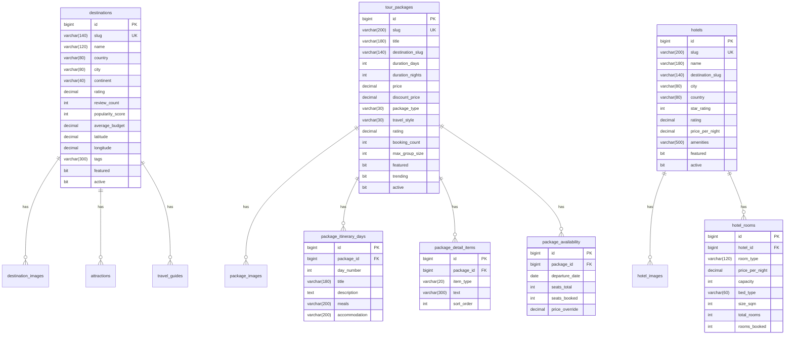
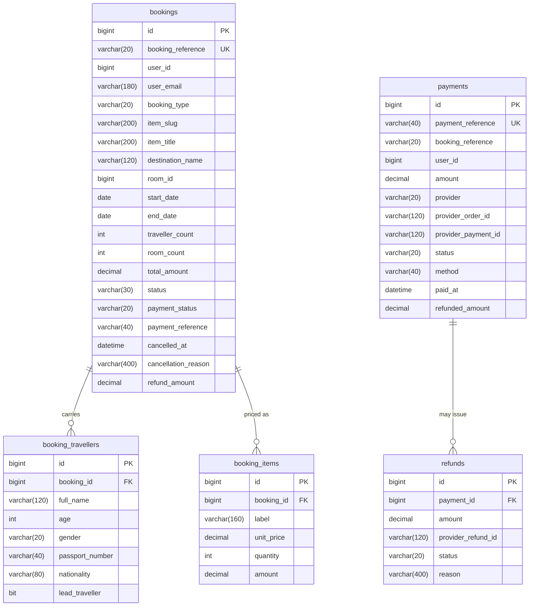
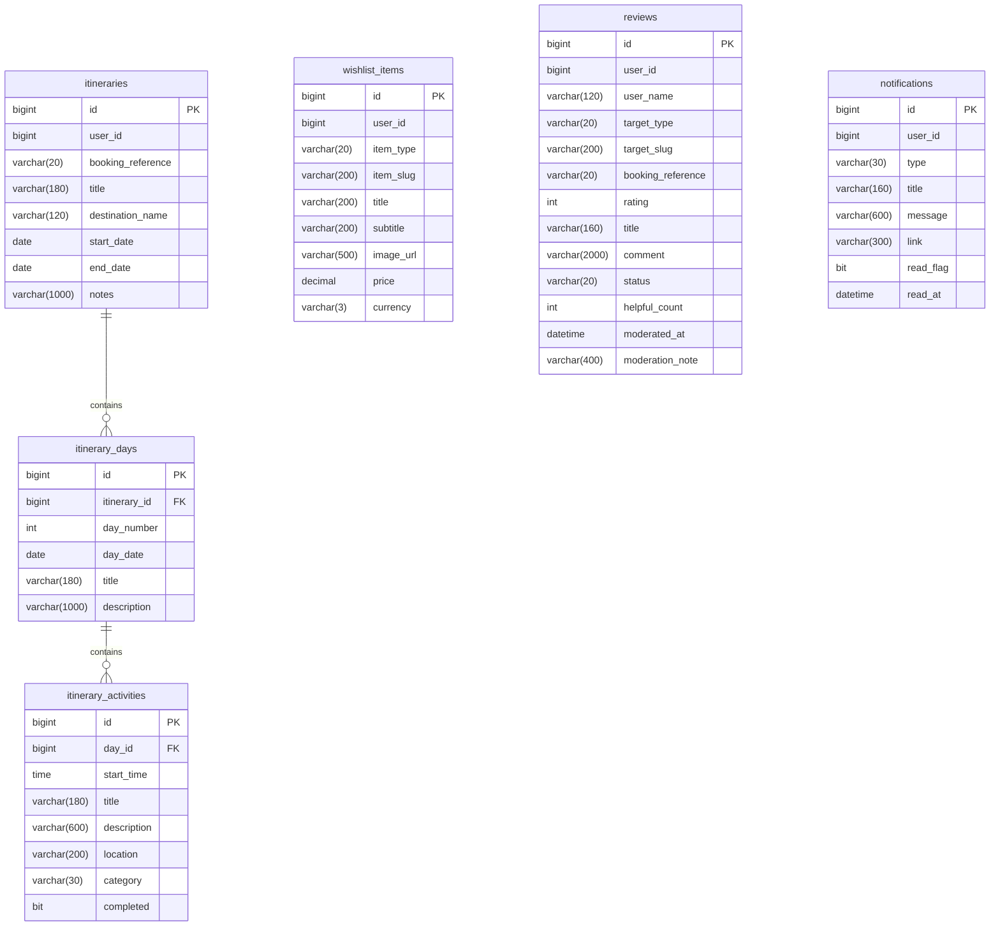

# GoTour — Database Design

Eleven services, eleven schemas. No service reads another's tables; there are no
cross-schema foreign keys and no shared tables.

| Schema | Owner service | Tables |
|---|---|---|
| `gotour_auth` | auth-service | `users`, `user_roles`, `refresh_tokens`, `password_reset_tokens` |
| `gotour_user` | user-service | `user_profiles`, `addresses` |
| `gotour_destination` | destination-service | `destinations`, `destination_images`, `attractions`, `travel_guides` |
| `gotour_package` | package-service | `tour_packages`, `package_images`, `package_itinerary_days`, `package_detail_items`, `package_availability` |
| `gotour_hotel` | hotel-service | `hotels`, `hotel_images`, `hotel_rooms` |
| `gotour_booking` | booking-service | `bookings`, `booking_travellers`, `booking_items` |
| `gotour_payment` | payment-service | `payments`, `refunds` |
| `gotour_wishlist` | wishlist-service | `wishlist_items` |
| `gotour_review` | review-service | `reviews` |
| `gotour_notification` | notification-service | `notifications` |
| `gotour_itinerary` | itinerary-service | `itineraries`, `itinerary_days`, `itinerary_activities` |

Schema is created and evolved by **Flyway**, versioned per service under
`services/<service>/src/main/resources/db/migration/`. Demo data ships as a
seed migration, so a fresh database is browsable immediately.

---

## Audit columns

Every table inherits five columns from `BaseEntity`:

| Column | Type | Purpose |
|---|---|---|
| `created_at` | `datetime(6)` | Set once on insert |
| `updated_at` | `datetime(6)` | Refreshed on every update |
| `created_by` | `varchar(100)` | Authenticated user id, or `system` |
| `updated_by` | `varchar(100)` | Last writer |
| `version` | `bigint` | JPA optimistic lock — prevents lost updates on concurrent inventory writes |

`version` matters most on `package_availability.seats_booked` and
`hotel_rooms.rooms_booked`: two simultaneous bookings for the last seat make one
transaction fail and retry rather than both succeeding.

---

## ER diagrams

### Identity — `gotour_auth` + `gotour_user`

```mermaid
erDiagram
    users ||--o{ user_roles : has
    users ||--o{ refresh_tokens : issues
    users ||--o{ password_reset_tokens : requests
    user_profiles ||--o{ addresses : owns

    users {
        bigint id PK
        varchar(180) email UK
        varchar(100) password_hash
        varchar(120) full_name
        varchar(20) phone
        bit enabled
        bit email_verified
        int failed_login_attempts
        datetime locked_until
        datetime last_login_at
    }
    user_roles {
        bigint user_id PK_FK
        varchar(30) role PK
    }
    refresh_tokens {
        bigint id PK
        bigint user_id FK
        varchar(64) token_hash UK
        datetime expires_at
        bit revoked
        datetime revoked_at
    }
    password_reset_tokens {
        bigint id PK
        bigint user_id FK
        varchar(64) token_hash UK
        datetime expires_at
        bit used
    }
    user_profiles {
        bigint id PK
        bigint user_id UK
        varchar(180) email
        varchar(120) full_name
        varchar(20) phone
        varchar(500) avatar_url
        date date_of_birth
        varchar(20) gender
        varchar(80) nationality
        varchar(500) bio
        varchar(3) preferred_currency
        bit marketing_opt_in
    }
    addresses {
        bigint id PK
        bigint user_id FK
        varchar(40) label
        varchar(180) line1
        varchar(180) line2
        varchar(80) city
        varchar(80) state
        varchar(80) country
        varchar(20) postal_code
        bit is_default
    }
```

`user_profiles.user_id` mirrors `users.id` across a service boundary — it is a
logical reference, not a database foreign key, because the schemas are separate.

### Catalogue — destinations, packages, hotels



Two modelling notes:

- **`package_detail_items` is one table with an `item_type` discriminator**
  (`INCLUSION` / `EXCLUSION` / `HIGHLIGHT`) rather than three near-identical
  tables. All three are an ordered list of strings attached to a package.
- **Availability stores `seats_total` and `seats_booked`, not `seats_available`.**
  A derived value cannot drift; a stored one can.

### Transactions — bookings and payments



`bookings` **denormalises** `item_title`, `item_image_url` and
`destination_name` at write time. This is intentional: a booking is a historical
record. If a package is renamed or delisted next year, the customer's booking
must still render exactly as it was purchased — and listing bookings must not
require a fan-out call to package-service.

`payments.booking_reference` links across a service boundary by business key,
not by foreign key.

### Engagement — wishlist, reviews, notifications, itineraries



`wishlist_items` and `reviews` use a `(target_type, target_slug)` pair rather
than a polymorphic foreign key — the only workable approach when the referenced
rows live in another service's database.

---

## Indexing strategy

Indexes follow the actual query patterns, not guesswork.

**Uniqueness / identity**

| Index | Reason |
|---|---|
| `users.email` UNIQUE | Login lookup and duplicate-registration guard |
| `destinations.slug`, `tour_packages.slug`, `hotels.slug` UNIQUE | Every public detail page is a slug lookup |
| `bookings.booking_reference` UNIQUE | Customer-facing identifier used in every lookup |
| `payments.payment_reference` UNIQUE | Provider reconciliation key |
| `refresh_tokens.token_hash`, `password_reset_tokens.token_hash` UNIQUE | Constant-time token lookup |

**Filtering and sorting**

| Index | Serves |
|---|---|
| `destinations(country)`, `destinations(popularity_score)`, `destinations(active)` | Country facet; default "most popular" sort; active-only filter |
| `tour_packages(price)`, `tour_packages(rating)`, `tour_packages(active)`, `tour_packages(destination_slug)` | Price and rating sorts, catalogue filter, destination drill-down |
| `hotels(price_per_night)`, `hotels(active)`, `hotels(destination_slug)` | Same for hotels |
| `bookings(user_id)`, `bookings(status)`, `bookings(created_at)` | "My bookings"; admin status filter; newest-first ordering |
| `payments(booking_reference)`, `payments(user_id)`, `payments(status)` | Payment lookup by booking; history; admin filter |
| `reviews(target_type, target_slug)` | Composite — every review list filters on both together |
| `reviews(status)` | Moderation queue |
| `wishlist_items(user_id)` | Every wishlist read is user-scoped |
| `notifications(user_id)` | Notification list and unread count |
| `itineraries(user_id)`, `itineraries(booking_reference)` | Trip list; linking a trip to its booking |

**Foreign keys** are indexed automatically by InnoDB, which covers every
parent → child join (`package_availability.package_id`, `hotel_rooms.hotel_id`,
`booking_travellers.booking_id`, and so on).

**Deliberately not indexed:** free-text `search` filters run `LIKE '%term%'`,
which no B-tree can serve. At current volumes a scan is fine. The upgrade path
is a MySQL `FULLTEXT` index or an external search engine — noted in
[../docs/ROADMAP.md](../docs/ROADMAP.md).

---

## Conventions

- **`snake_case`** for tables and columns; JPA maps to `camelCase` fields.
- **Plural table names** (`bookings`, not `booking`).
- **`utf8mb4` / `utf8mb4_unicode_ci`** everywhere — destination names contain
  accents and non-Latin scripts.
- **`decimal(12,2)` for money.** Never `float` or `double`.
- **Enums stored as `varchar`**, not MySQL `ENUM` — adding a value is a code
  change, not a schema migration with a table rebuild.
- **`datetime(6)`** (microsecond precision) for all timestamps.
- **Booleans as `bit(1)`**, Hibernate's default mapping.

---

## Working with migrations

```bash
# Create the empty databases (once)
mysql -u root -p < scripts/create-databases.sql

# Flyway runs automatically on service start.
# Inspect what has been applied:
mysql -u root -p -e "SELECT version, description, success FROM gotour_package.flyway_schema_history;"

# Reset one service's schema during development
mysql -u root -p -e "DROP DATABASE gotour_package; CREATE DATABASE gotour_package CHARACTER SET utf8mb4;"
```

**Never edit a migration that has been applied** — Flyway validates checksums
and will refuse to start. Add a new versioned migration instead.
